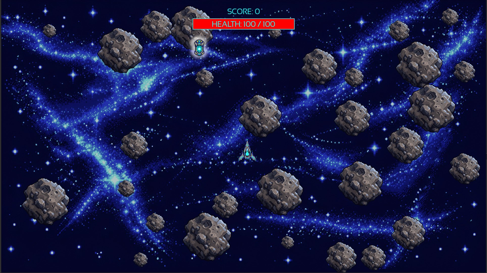

# 🚀 Space Salvager

**Space Salvager** is a small 2D score-attack survival game written in **C++14** using **SFML 2.5.1**.

The player controls a spacecraft, collects salvage and tries to survive as long as possible while avoiding moving asteroids.

The game is built around a simple loop:

**fly → collect salvage → increase score → repair the ship → survive collisions → beat your previous record**

---

## 🎮 Gameplay



There is no fixed win condition — the goal is to achieve the highest possible score.

Collecting salvage:

- increases the player's score;
- restores a small amount of ship health.

Collisions with asteroids damage the ship depending on the collision impulse.

---

## 🕹️ Controls

| Key | Action |
| --- | --- |
| `↑` | Thrust |
| `←` | Rotate left |
| `→` | Rotate right |
| `E` | Collect salvage |
| `R` | Restart after Game Over |
| `F1` | Toggle debug information |
| `Esc` | Exit |

---

## 🧩 Project Structure

The project is split into several small systems with separate responsibilities:

- **Engine** — application lifecycle, main loop, input and rendering coordination
- **World** — owns and coordinates game objects and simulation
- **Ship** — player movement and ship state
- **Asteroid** — moving physical obstacles
- **CollisionManager** — collision detection and collision response
- **GameplayManager** — salvage interaction, score and Game Over logic
- **InputManager** — converts SFML events into gameplay actions
- **ResourceManager** — manages texture and font resources
- **HUD** — displays gameplay information

---

## 🎯 Project Purpose

Space Salvager was created as a practical C++ project focused on building a small but complete real-time application.

The main goal was not to build a large game, but to practice and apply:

- C++ object lifetime and ownership
- separation of responsibilities
- real-time input processing
- collision physics
- gameplay state management
- resource management
- application architecture
- refactoring

---

## 🛠️ Tech Stack

- **C++14**
- **SFML 2.5.1**
- **CMake**
- **GCC**
- **MSVC**
- **Linux**
- **Windows**

---

## 🐧 Building on Linux

The current CMake build has been tested on **Ubuntu 22.04**.

### Requirements

- CMake 3.16+
- C++14-compatible compiler
- SFML 2.5.1

Install the required packages:

```bash
sudo apt update
sudo apt install build-essential cmake libsfml-dev
```

Clone the repository:

```bash
git clone ...
cd SpaceSalvager
```

Configure the project:

```bash
cmake -S . -B build
```

Build:

```bash
cmake --build build
```

The executable and game resources are placed together in:

```text
build/SpaceSalvager/
├── SpaceSalvager
└── res/
```

Run the game:

```bash
cd build/SpaceSalvager
./SpaceSalvager
```

---

## 🪟 Windows

Space Salvager was originally developed on:

- Windows 7
- Visual Studio 2015
- MSVC v140
- SFML 2.5.1
- static SFML linking

Windows builds require a compatible SFML 2.5.1 distribution for the selected MSVC toolset.

Additional information about Windows dependencies is available in:

```text
third_party_for_windows/README.md
```

---

## 📦 Repository Layout

```text
SpaceSalvager/
├── CMakeLists.txt
├── README.md
├── res/
│   ├── fonts/
│   └── texture/
├── src/
│   ├── *.cpp
│   └── *.h
└── third_party_for_windows/
    └── README.md
```

---

## Gameplay v1.0

The core gameplay loop is complete and playable.

Current version includes:

- ship movement;
- asteroid collisions;
- damage and repair;
- score system;
- recovery mechanic;
- HUD;
- Game Over state;
- session restart.

---


## 👨‍💻 Author

**Alexey Markov**

C++ developer interested in real-time systems, simulation software, application architecture and modern C++.
